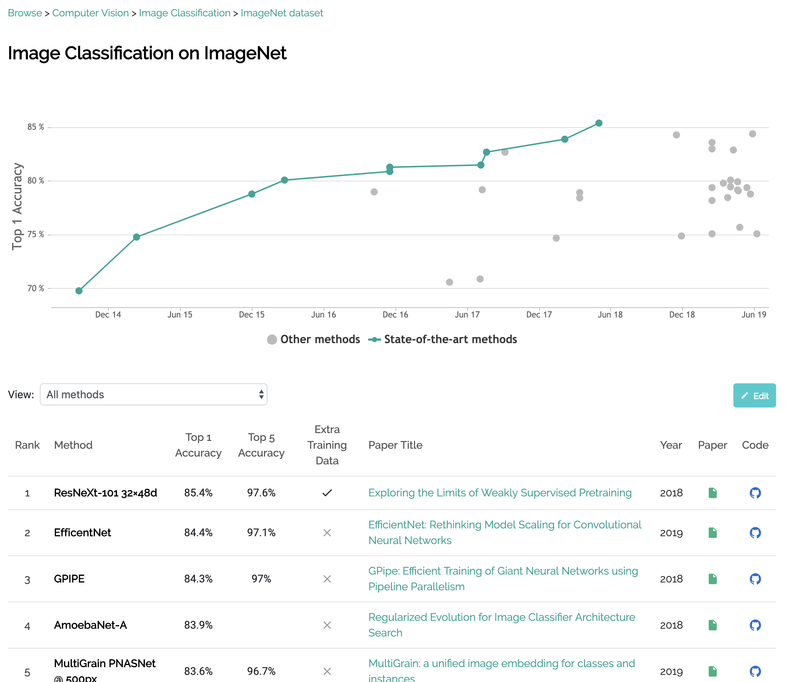

# Getting in Started

## What You Will Learn

In this tutorial, you will submit your first machine learning model
implementation to the Sotabench resource. You will:

- 🔎 **Find** an implementation of a modern image classification model
- 📊 **Configure** a `benchmark.py` file to evaluate the model
- 🎉 **Submit** the repository to sotabench and obtain *state-of-the-art*
  results!

Sound fun? Let's get started!

## Find an Image Classification Model

To find model implementations, we use [Papers With Code](), which has over
10,000 implementations and also ranks them according to their performance on
popular research benchmarks.

Search for **Image Classification**:

This will bring you to the **Task Page**, where you can see various different
*benchmarks* for evaluating the performance of models on image classification:

Let's click on **ImageNet** since this is now the most famous image
classification benchmark:

This is the **Evaluation Page**. From the graph, we can see the historical
progress on the task, and how models have got better over time. Below we can
see the leaderboard of the best methods, ranked by performance.

Let's click on the top paper **Exploring the Limits of Weakly Supervised
Pretraining**. This brings us to the paper page where we can see publicly
available implementations:

There is an implementation in PyTorch, which we can evaluate using sotabench.
Head to the repository:
